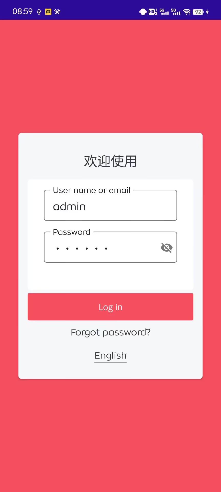
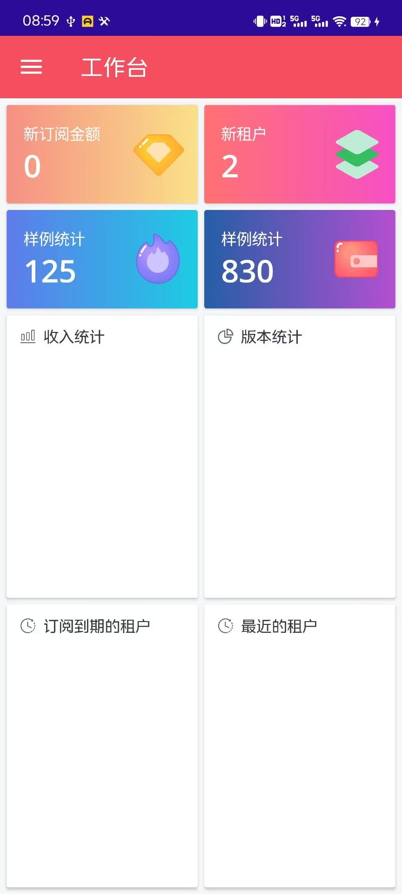
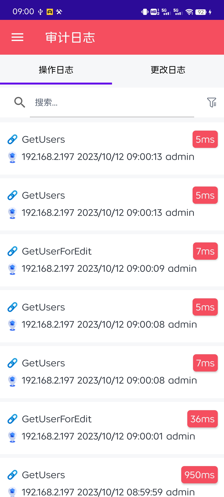
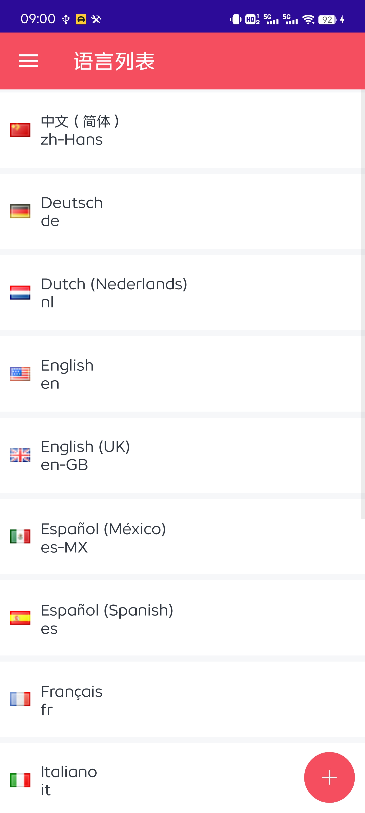

- ## 介绍
  国内首个基于.NET 7 版本的MAUI ABP框架正式发布！本套框架主要针对原.NET 6版本的 WPF/Xamarin.Forms ABP框架升级。升级如下:
  - .NET 6 版本升级至 .NET 7
  - ABP 7.3 升级至 ABP 8.0
  - Xamarin.Forms 升级至 MAUI
  [.NET 6 版本的 WPF ABP 现已升级至 .NET7 ](https://www.cnblogs.com/zh7791/p/17743274.html)

  ## 功能介绍
  与.NET 6版本的Xamarin.Forms ABP框架相比，升级功能如下:
  - 系统设置功能
  - 多语言内容配置
  - 审计日志的高级筛选/更改日志
  - 动态属性的配置
  - MAUI Syncfusion套件
  - 基于原生的系统导航
  - 数据表单/验证器
  - 多语言
  - 皮肤设置 深色/浅色/多颜色主题

  ## 获取源代码
  本次发布全新的MAUI框架，将以公益活动的形式发布，本次源代码的所有收入，将和往期一致，将捐赠给慈善机构组织/学校/贫困条件学生等形式。
  捐赠形式以阶段性进行视频公开捐赠，所有视频发布至: B站/抖音/西瓜视频等平台同步。

  费用: 299/人

  作者 QQ：779149549
  参与公益活动，添加好友，请备注由来，多谢！

  * 说明:参与本次公益活动的所有朋友，可获取该框架的后续免费升级，文档和技术教程支持，以及单独的VIP群。
  * 另外: 关于往期参与了公益活动的朋友，可以和本人取得联系，咨询最新的框架源代码和VIP服务。

  ## 框架优势
  作为国内的首个提供了接近于商业化项目的MAUI框架，让学习MAUI以及正在使用MAUI的朋友有一个全面的认知。
  内置功能全方面表达: 系统导航，授权，主题，多语言，手势，窗口，消息，依赖注入，控件，表单。

## 项目运行截图

- 登录页

- 首页

- 用户页

- 用户页

- 审计日志

- 语言列表

- 系统设置

