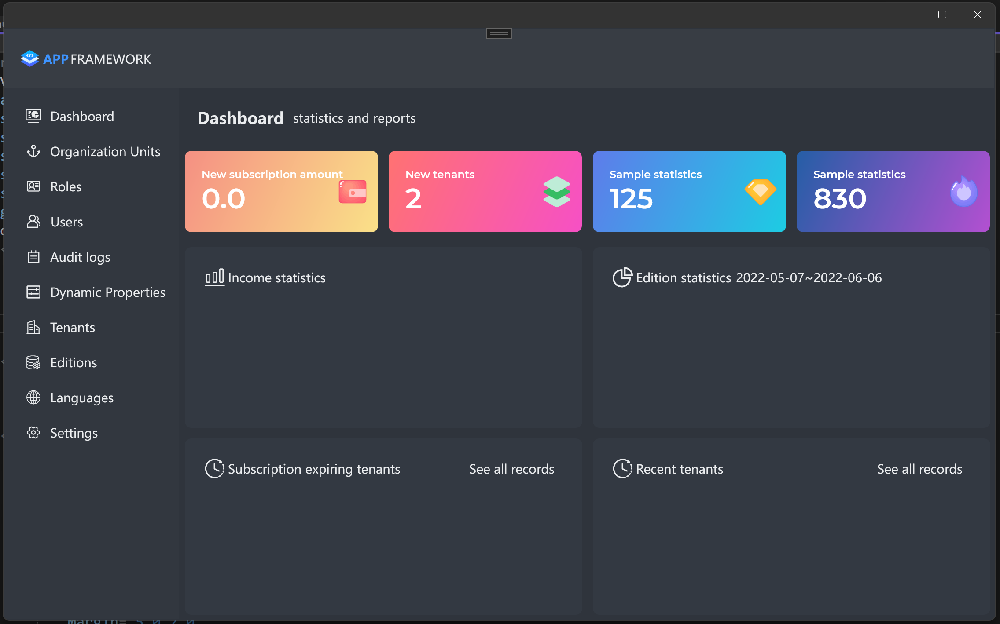
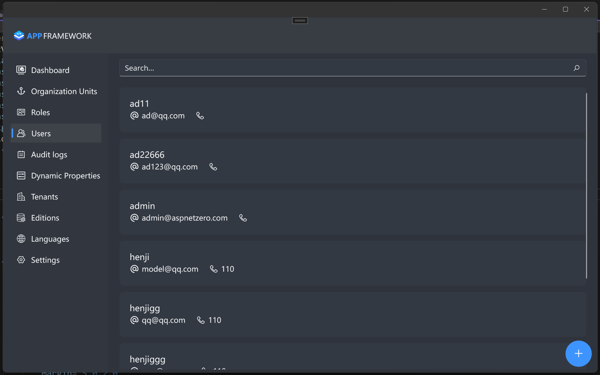
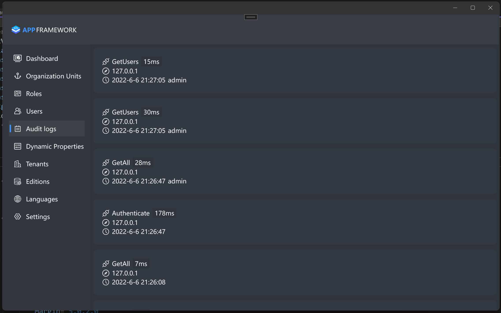
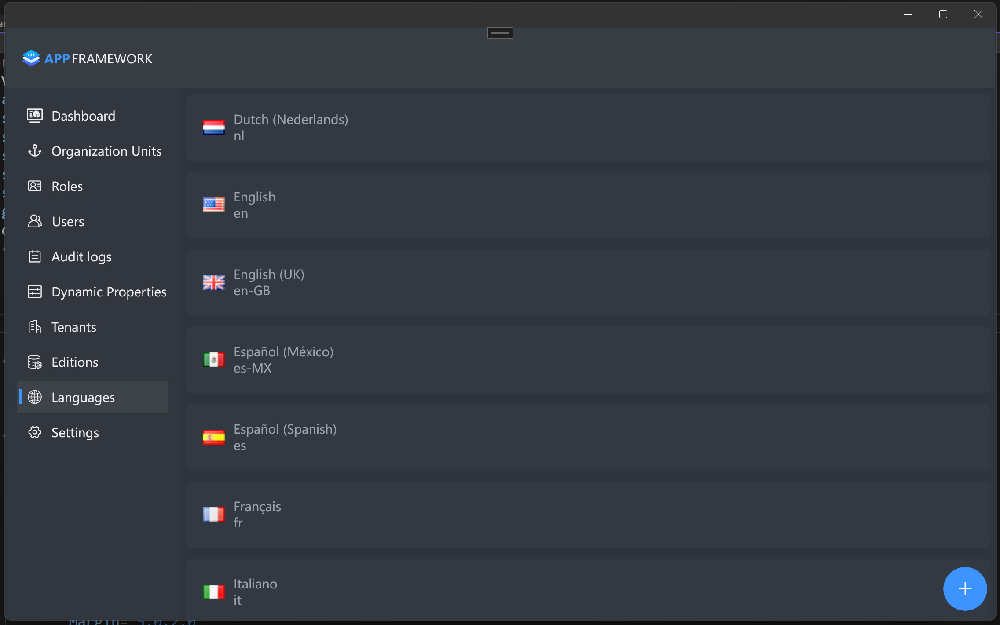

## 简介

众所周知, MAUI发布正式版本了, 那么对应, 本套框架则是基于MAUI框架进行开发。

本套框架功能包含如下: 

- 用户与角色管理
- 组织机构
- 权限管理
- 多租户
- 本地化多语言
- 身份认证及授权
- 审计日志记录
- UI主题
- 异常处理
- 数据字典
- 系统设置

部分功能持续跟进中...

## 项目说明

ABP官方未正式提供完整版本MAUI框架, 所以就出现了该套框架，来弥补市场的空白。

并且ABP商业版中, 提供的Xamarin.Forms框架也是非常的简陋 , 所以本套框架也包含完整的Xamarin.Forms版本。 

## 项目授权

该存储库未包含完整的MAUI代码,  仅包含部分业务代码实现,  无法正常编译且运行, 如果您对相关商业授权感兴趣, 可以主动联系作者咨询, 添加请注明来意。

- QQ：779149549
- Email:  779149549@qq.com 

## 项目运行截图

- 登录页

- 首页

- 用户页

- 审计日志

- 语言列表

- 系统设置

